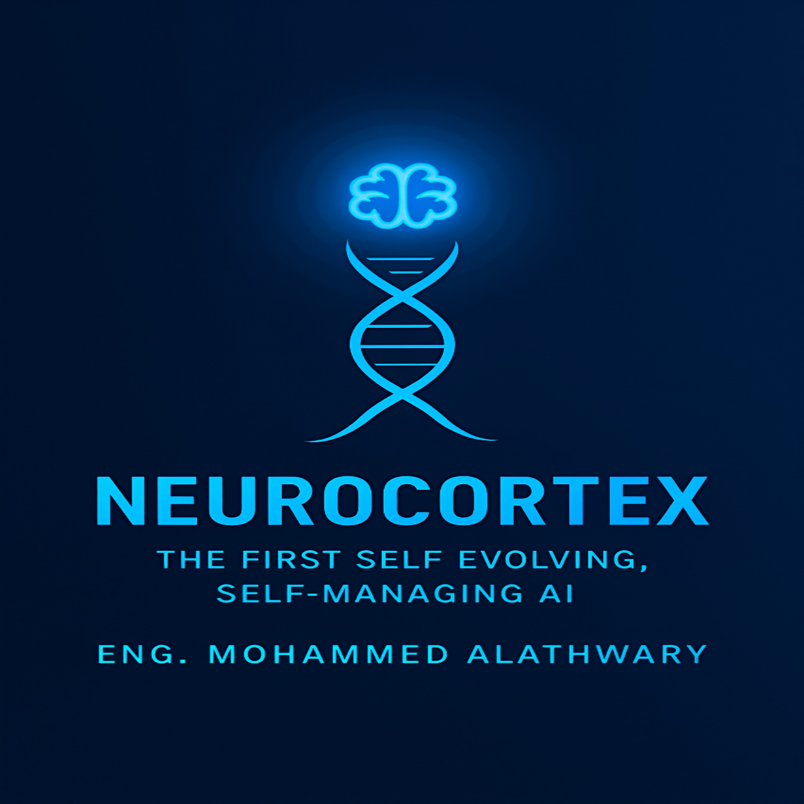

🧠 NeuroCortex: The Self-Evolving AI Framework

  

  <strong>Self-Reinforcing Development Framework (SRDF)</strong>

  
  
  
  

  
  
  
  
  
  

Author: Mohammed Qaid Al-Athwary
ORCID iD: "0009-0006-9075-072X" (https://orcid.org/0009-0006-9075-072X)

---

NeuroCortex is a research framework centered on the Self-Reinforcing Development Framework (SRDF).

SRDF describes a controlled closed-loop approach for runtime structural adaptation in AI systems. Instead of allowing unrestricted self-modification, the framework separates the adaptation process into explicit stages for observation, candidate generation, evaluation, authorization, and controlled state transition.

---

📑 Table of Contents

- "🧠 Overview" (#-overview)
- "🧩 The SRDF Architecture" (#-the-srdf-architecture)
- "🔬 Prototype" (#-prototype)
- "🚀 Vision" (#-vision)
- "📄 Whitepapers" (#-whitepapers)
- "🔮 Applications" (#-applications)
- "🧪 Examples" (#-examples)
- "💻 Installation" (#-installation)
- "▶️ Usage" (#️-usage)
- "📊 Reproducibility" (#-reproducibility)
- "🤝 Contributing" (#-contributing)
- "📜 License" (#-license)
- "📚 Citing NeuroCortex" (#-citing-neurocortex)
- "📞 Contact" (#-contact)
- "🙏 Acknowledgements" (#-acknowledgements)
- "⚠️ Research Scope" (#️-research-scope)

---

🧠 Overview

NeuroCortex is a research framework centered on the Self-Reinforcing Development Framework (SRDF).

SRDF describes a controlled closed-loop approach for runtime structural adaptation in AI systems. Instead of allowing unrestricted self-modification, the framework separates the adaptation process into explicit stages for observation, candidate generation, evaluation, authorization, and controlled state transition.

The framework is organized around three principal components:

- Trawler — analyzes the current context and identifies conditions that may justify adaptation.
- Generator — produces candidate structural or learning modifications.
- Arbiter — evaluates candidates against predefined constraints and authorizes only candidates that satisfy the required conditions.

The repository includes an executable toy prototype demonstrating this workflow in a controlled synthetic environment.

«Important: The included prototype is a feasibility demonstration of the SRDF workflow. Its single-run results do not establish general performance superiority, statistical significance, general AI safety, or generalization beyond the experimental setting.»

---

🧩 The SRDF Architecture

The SRDF workflow can be represented as:

Current State
      │
      ▼
┌─────────────┐
│   Trawler   │
└──────┬──────┘
       │
       ▼
┌─────────────┐
│  Generator  │
└──────┬──────┘
       │
       ▼
┌────────────────────┐
│ Candidate Evaluation│
└─────────┬──────────┘
          │
          ▼
┌────────────────────┐
│   Hybrid Arbiter   │
└─────────┬──────────┘
          │
      ┌───┴───┐
      │       │
    Reject  Accept
      │       │
      │       ▼
      │     Commit
      │       │
      └───┬───┘
          ▼
    Updated State

1. Trawler

The Trawler observes the current execution context and searches for conditions that may trigger adaptation.

In the toy prototype, the demonstrated trigger is class imbalance in the training data.

2. Generator

The Generator produces a bounded set of candidate modifications.

The prototype demonstrates candidate generation using alternative model structures, including:

- Gradient Boosting
- SMOTE + Random Forest

3. Candidate Evaluation

Each candidate is evaluated using predefined performance, safety, and resource criteria.

The prototype records:

- Accuracy
- Precision
- Recall
- F1 score
- Safety checks
- Resource cost
- Utility score

4. Hybrid Arbiter

The Arbiter acts as the authorization layer.

A candidate must satisfy the required conditions, including:

- Structural invariants
- Resource constraints
- Safety checks
- Utility threshold

Only an authorized candidate can be committed to the runtime state.

5. Controlled State Transition

If a candidate passes authorization, the execution graph is updated and the runtime state version is incremented.

If candidates are rejected, the existing state is preserved.

---

## 🔬 Prototype

The repository contains an executable toy implementation of the SRDF workflow:

`notebooks/NeuroCortex_SRDF_Toy_Prototype_v2.0.ipynb`

The prototype demonstrates:

- Synthetic environment creation
- Explicit runtime state
- Context acquisition
- Trawler analysis
- Baseline model evaluation
- Structural candidate generation
- Candidate evaluation
- Structural invariant checking
- Hybrid Arbiter authorization
- Authorized candidate selection
- Commit or rejection
- Observed outcome
- Comparison of candidate configurations
- Visualization
- Execution graph transition
- JSON experiment record
- Automated prototype audit
- Scientific interpretation

The prototype is intentionally presented as a toy feasibility demonstration, not as a comprehensive benchmark of self-evolving AI.

### Prototype Interpretation

The experiment demonstrates a bounded:

**Observe → Analyze → Generate → Evaluate → Authorize → Commit / Reject → Updated State**

workflow.

The numerical results generated by the notebook belong to the specific execution of that experiment and should not be interpreted as evidence of general superiority or universal applicability.
---

🚀 Vision

The long-term research direction of NeuroCortex is to investigate AI systems capable of managing controlled aspects of their own development lifecycle.

The intended direction includes:

- Runtime adaptation
- Structural modification
- Explicit evaluation before modification
- Constraint-based authorization
- State preservation after rejected modifications
- Resource-aware adaptation
- Auditable decision records

The framework does not assume unrestricted self-modification. Instead, it investigates whether self-directed adaptation can be organized as a controlled and auditable process.

---

📄 Whitepapers

English

"English Whitepaper PDF" (https://github.com/mohammedqaidamanlift-hub/-NEUROCORTEX/blob/main/Self_Evolving_AI_Whitepaper_EN_Final.pdf)

Arabic

"Arabic Whitepaper PDF" (https://github.com/mohammedqaidamanlift-hub/-NEUROCORTEX/blob/main/%20Self_Evolving_AI_Whitepaper_AR_Final.pdf)

The repository and associated research materials provide the conceptual and technical background for the SRDF framework.

---

🔮 Applications

The SRDF concept is intended as a general research framework that may be investigated in areas such as:

- Adaptive Machine Learning — controlled adaptation of model structures and learning strategies.
- AI Systems — runtime management of evolving computational components.
- Engineering — adaptive optimization and configuration of computational systems.
- Industrial Automation — controlled adaptation of system configurations.
- Cybersecurity — investigation of adaptive defensive architectures.
- Scientific Computing — automated selection and modification of computational strategies.

These are potential research directions rather than claims that the current prototype has been validated for production use in these domains.

---

🧪 Examples

NeuroCortex SRDF Toy Prototype v2.0

"Open in Google Colab" (https://colab.research.google.com/github/mohammedqaidamanlift-hub/-NEUROCORTEX/blob/main/notebooks/NeuroCortex_SRDF_Toy_Prototype_v2.0.ipynb)

This notebook demonstrates the complete controlled adaptation workflow, including candidate generation, evaluation, invariant checking, Arbiter authorization, state transition, result serialization, and automated auditing.

---

💻 Installation

Clone the repository:

git clone https://github.com/mohammedqaidamanlift-hub/-NEUROCORTEX.git
cd -NEUROCORTEX

For the notebook prototype, install the required Python packages:

pip install scikit-learn imbalanced-learn numpy pandas matplotlib seaborn

The prototype can then be opened with Jupyter Notebook or Google Colab.

---

▶️ Usage

Google Colab

Open the official prototype directly:

""Open In Colab" (https://colab.research.google.com/assets/colab-badge.svg)" (https://colab.research.google.com/github/mohammedqaidamanlift-hub/-NEUROCORTEX/blob/main/notebooks/NeuroCortex_SRDF_Toy_Prototype_v2.0.ipynb)

Run the notebook cells sequentially.

Local Jupyter Environment

From the repository root:

jupyter notebook notebooks/NeuroCortex_SRDF_Toy_Prototype_v2.0.ipynb

The prototype generates an experiment record named:

srdf_v2_results.json

The JSON record contains the configuration, dataset information, baseline metrics, candidate evaluations, authorization decisions, state transition, and observed outcome.

---

📊 Reproducibility

The prototype uses a fixed random seed:

SEED = 42

The experiment is therefore designed to provide a reproducible single-run demonstration under the same software environment and configuration.

The experiment should nevertheless be interpreted as a toy prototype execution, not as a statistically powered benchmark.

---

🤝 Contributing

Contributions, technical discussions, and research-oriented feedback are welcome.

Before proposing major changes, please consider whether the change:

- Preserves the conceptual SRDF workflow.
- Maintains explicit authorization before state modification.
- Preserves structural and safety constraints.
- Improves reproducibility or auditability.
- Is supported by appropriate experimental evidence.

For substantial architectural changes, please open an issue to discuss the proposed direction before submitting a pull request.

---

📜 License

This project is released under the Apache License 2.0.

See the "LICENSE" (LICENSE) file for the complete license text.

---

📚 Citing NeuroCortex

If you use NeuroCortex or the SRDF framework in academic or technical work, please cite the associated research record:

Mohammed Qaid Al-Athwary. NeuroCortex / Self-Reinforcing Development Framework.

DOI:
https://doi.org/10.5281/zenodo.16945431

ORCID:
https://orcid.org/0009-0006-9075-072X

---

📞 Contact

For research-related inquiries, technical discussions, or collaboration:

Mohammed Qaid Al-Athwary

Email: mohammedqaidalathwary@gmail.com

LinkedIn: "Mohammed Qaid Al-Athwary" (https://www.linkedin.com/in/Mohammed-Qaid-Alathwary)

---

🙏 Acknowledgements

The NeuroCortex project is developed as an independent research effort exploring controlled self-adaptation and self-management mechanisms for AI systems.

Feedback, technical discussion, and reproducible experimentation are welcomed.

---

⚠️ Research Scope

NeuroCortex is an ongoing research project.

The current repository prototype should not be interpreted as demonstrating:

- General self-evolving artificial intelligence
- Unrestricted program synthesis
- Universal AI safety
- Statistical significance
- General performance superiority
- Superiority over existing adaptive-agent architectures
- Production readiness
- Generalization beyond the demonstrated experimental setting

The purpose of the prototype is to provide an executable and auditable demonstration of the proposed SRDF control workflow.
